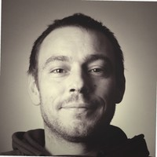

# Kewin Marchand 
## Intégrateur et Développeur Front-End
### En charge du développement et de l'intégration des projets web au sein de Purjus Communication, agence de communication globale.

#### Vauvenargues, Provence-Alpes-Côte d’Azur, France 

---

## Compétences

- [x] Utilisations quotidienne des principaux frameworks JS, principalement *React* mais aussi Vue, Svelte, Angular. 💪💪💪
- [x] Recherche et mise en place de packages *NPM*, veille portant sur les nouveaux plugins et frameworks Ui. 💪💪💪
- [x] *HTML*, *TWIG*. 💪💪💪
- [x] *CSS*, SASS, JSS. 💪💪💪
- [x] *Vanilla JS*, *Typescript*. 💪💪💪
- [x] Sites *responsives*, *mobile first*. 💪💪💪
- [x] Animations CSS, *SVG*, React. 💪💪💪
- [x] Code review. 💪💪💪
- [x] Attention portée aux problématiques liées à l'*accessibilité* et à la *RGPD*. 💪💪
- [x] Ecriture de fonctions de tests unitaires, *CodeceptJs*. 💪
- [x] Applications mobile *React native*. 💪
- [x] Environnement: Docker, Symfony, Sonata, React admin, Node, Next, Redux... 💪

---

## Réalisations

Site e-commerce [RRG](https://www.renault-retail-group.fr/), Groupe Renault.
>Achat et réservation de véhicules et accessoires automobile.
>>**Maintenance et migration des anciennes pages**, **intégration et développement React.**

Site de recrutement [RRG RH](https://jobsfrance.renaultretailgroup.com/), Groupe Renault.
>Site dédié à la consultation des annonces d'emplois de la société et aux dépots des candidatures des internautes qui l'utilisent.
>>**Intégration et développement TWIG, SASS et Vue JS.**

Site de recrutement [Sodicam²](https://sodicam2.fr/), Groupe Renault.
>Société de Distribution pour la Chimie, l'Automobile et la Mécanique chargée de la commercialisation et de l'animation des pièces, accessoires et services après-vente automobile.
>>**Intégration et développement TWIG, SASS et Vanilla JS.**

Site vitrine multilingue [Facets](https://facets.fr/fr)
>Agence événementielle.
>>**Intégration et développement Next, React, Framer.**

Site vitrine multilingue [Oreca events](https://oreca-events.com/fr)
>Agence expérientielle automobile
>>**Intégration et développement Next, React, Framer.**

Applis [Datagora web](https://datagora.fr/) et [Datagora mobile](https://play.google.com/store/apps/details?id=com.datagora&hl=en_SG&gl=US)
>Sous la forme d’un fil d'actualité, la plateforme Datagora vous propose des dépêches synthétiques - les datapoints - qui mettent en avant les résultats clés de publications provenant d'instituts statistiques, d'études ou de recherche.
>>**Intégration et développement React et React native.**

Site e-commerce [Dépamoto](https://depamoto.com/fr-FR/home)
>Vente de moto et pièces détrachées en ligne.
>>**Participation à l'intégration du site TWIG et Vue js.**

Site vitrine [AD13](https://comites-feux.com/)
>Association Départementale des Comités Communaux Feux de Forêts et des Réserves Communales de Sécurité Civile des Bouches du Rhône.
>>**Intégration et développement React et React admin.**

Site vitrine [Les soirées de St Marc](https://lessoireesdesaintmarc.fr/)
>Association loi 1901 organisatrice d'un festival en région Aixoise. 
>>**Intégration et développement HTML, CSS et Vanilla JS.**

Site vitrine [Kering Foundation](https://www.keringfoundation.org/en/)
>Fondation en vue de soutenir les femmes touchées par la violence.
>>**Intégration et développement HTML, CSS et Vanilla JS.**

---

## Parcours
### 💻 Développement web :

- 08/2018 à aujourd'hui : **Intégrateur et développeur Front-End** (Purjus Communication).
- 09/2017 à 08/2018 : **Formateur Infographiste en multimédia** (AFPA Avigon le Pontet).
- 05/2017 à 09/2017 : **Intégrateur web** (Agence Hors Pistes et Freelance).

### 🌳 Paysagisme :
- 04/2015 à 05/2017 : **Infographiste paysager** (Star's Jardin, Thibaud de Beschart).
- 05/2005 à 03/2013 : **Ouvrier paysagiste qualifié** (Indépendant, ManieBat, Jardins Sestian).

---

## Formation

- 2016/2017 : **Designer web**, Afpa le Pontet (Titre professionnel de niveau III).
- 2014/2015 : **Les énergies renouvelables d'aujourd'hui et de demain**, IRFEDD (Attestation compétences).
- 2014 : **DAO - Professionnaliser sa pratique**, GRETA (Attestation compétences).
- 1999/2005 : **Aménagement de l'espace paysager**, CFPPA Auzeville Tolosane (BEP, BAC pro, BTS).

---

## Centres d'interêt

- Programmation
- Botanique
- Lecture

---

## Langues

- Français (langue maternelle)
- Anglais (scolaire, technique)
- Castillan (scolaire)

---

## À propos

- Né le 03/11/1982 à Paris XIV.

---

## Plus d'infos et contact

[Linkedin](https://www.linkedin.com/in/kewin-marchand/)

<!---
 <h2>🚀 Demo</h2>

[https://kewin-marchand.netlify.app/](https://kewin-marchand.netlify.app/)
 -->
 

